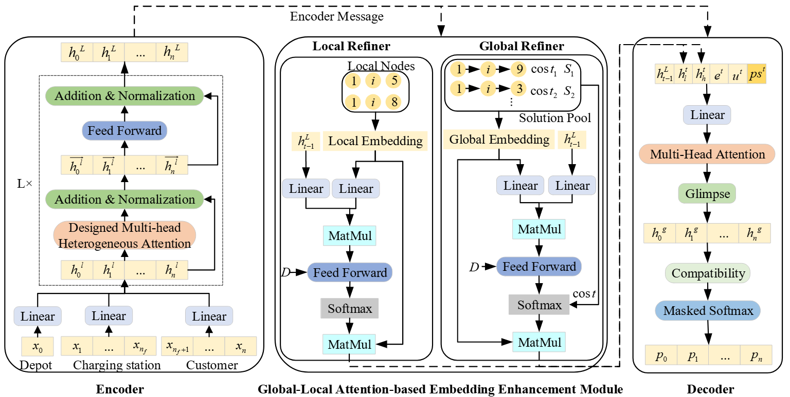

## Attention-Enhanced Deep Reinforcement Learning for Electric Vehicle Routing Optimization

### Paper Information

**Title**: Attention-Enhanced Deep Reinforcement Learning for Electric Vehicle Routing Optimization

The paper proposed an attention-enhanced deep reinforcement learning  algorithm for the electric vehicle routing problem. The method is aiming to solve the  routing problem especially for electric vehicles when there are more constrains are  considered, such as battery capability and charging stations.

### Dependencies

This project depends on the following packages:

- python(>=3.8)
- cuda(>=12.1)
- torch
- numpy
- rl4co(=0.5.0.dev0)
- torch-geometric
- torchrl(=0.4.0)
- tensordict(=0.4.0)